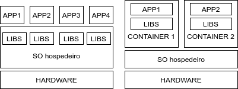

# Aula 1 - O que são containers?

<a href="../aula02">Próxima aula ❯</a>

 
Nesta aula, aprenderemos o básico de aplicações distribuídas em containers e containerização. Ao final desta aula, você deverá saber o que são containers e como eles funcionam. 

## Containers? O que são?
### A questão monolítica
A implantação clássica de sistemas de software normalmente é feita a partir de uma única aplicação contendo vários blocos ou módulos de regras de negócio que são "digitalizadas", automatizadas para suprir uma necessidade de negócio de forma moderna. Normalmente, principalmente em aplicações corporativas, acabamos com sistemas de software enormes, com muitas bibliotecas importadas, muitos blocos de código grandes e complexos, implantados em um único servidor com dependências instaladas e um sistema operacional específico. Tudo isso tornava a aplicação grande demais, e o processo de escalabilidade ficava caro e danoso. Era necessário aumentar recursos físicos do computador servidor para melhor atender a demanda do uso do software.

Existem diversas desvantagens nesta abordagem de software, que vão desde a implantação até a utilização do sistema. Qualquer atualização à aplicação ou até mesmo às bibliotecas, dependências e ao sistema operacional pode ocasionar em indisponibilidade da aplicação, o que gera problemas de custo, de banda, de utilização e risco ao negócio. Se mais de uma aplicação usar o mesmo host para execução, pode haver interrupção, o que causa diversos problemas de perfomance e de execução. Por conta disso, qualquer atualização de software ou de ambiente pode significa um enorme problema para equipe, e, consequentemente, uma parada completa da execução da aplicação, a deixando indisponível até que tudo se resolva. 

### E onde entram os containers?
A alternativa para diminuir a chance de problemas como esses acontecerem é usar a abordagem containerizada. Containers são, de forma simples, sistemas operacionais diminuídos, rodando dentro de outro sistema operacional. São como VMs, apesar de não serem VMs exatamente. Oferecem alguns dos mesmos benefícios das VMs, como um espaço segregado para execução, segurança e isolamento de rede. Mas ele funciona diferente de uma VM: containers também são sistemas virtualizados, mas apenas a camada de SO é virtualizada, e não as demais. É algo mais superficial que a VM tradicional, pois os containers são tratados e manuseados como processos de sistema operacional, e interage diretamente com os recursos disponíveis e com processos de kernel para criar os ambientes, e isso impede que ele tenha acesso ao ambiente físico foram dele, o que difere das VMs tradicionais. Diferente das VMs tradicionais, containers não interagem com o hypervisor, então processos em execução no container tem interação somente com o kernel e com o sistema operacional hospedeiro, diferentemente das VMs tradicionais, que interagem diretamente com o hypervisor. A imagem 1.1 mostra com mais clareza a diferença entre a execução tradicional de aplicações e a execução em containers.

<figure>
  
  <figcaption>Imagem 1.1 - Aplicações clássicas e containerizadas</figcaption>
</figure>

### Quais as vantagens de usar containers?
#### Recursos diretos do OS hospedeiro
Containers usam recursos internos do sistema operacional, e criam um ambiente isolado com recursos gerenciados por funções de SO, como namespaces e cgroups. Isso faz com que a carga no CPU físico seja mais baixa comparada ao hypervisor de uma VM convencional. Isso torna containers mais leves e rápidos que VMs.

#### Isolamento
Containers criam ambientes isolados, e alterações feitas no SO hospedeiro não afetam o container, e vice-versa. Isso torna toda a execução dentro de um container mais segura, garantindo que não haverá corrupções na máquina física que hospeda o container. Por se tratar de um ambiente efêmero, todas as bibliotecas e aplicações rodam dentro de seu container, e você pode implantar diversos outros containers para subir outras instâncias da sua aplicação, e alterações feitas em um container não afetam os demais containers.

#### Reuso
Com containers, você trata com imagens, que tem um set de instruções único. A imagem resultante dessas instruções criará um ambiente isolado para sua aplicação rodar, com todas as dependências necessárias já instaladas. Isso facilita a implantação de novas instâncias da aplicação, pois basta subir um container novo baseado numa imagem, e problemas de compatibilidade referentes a atualizações e afins são minimizados.

Por conta das qualidades de reuso e de isolamento, é mais viável que cada aplicação ou recurso use seu próprio container ao invés da aproximação monolítica clássica, onde um único host executa a aplicação, suas bibliotecas, dependências, banco de dados, sistemas de arquivos e tudo mais. Esta abordagem não é recomendada quando se usa containers, pois a imagem acaba se tornando grande e complexa, e mais difícil de ser mantida. Por conta da flexibilidade oferecida por containers, é mais viável o uso de diversos containers executando em rede, comunicando-se entre si, cada um com seu próprio domínio - i.e., um container executando somente PostgreSQL, outro executando somente a aplicação backend, outro executando somente a aplicação frontend, e todos se comunicando e enviando chamadas um para os outros. 

Desta forma, é possível aumentar recursos somente do que for necessário, eliminando a necessidade de aumentar o número de containers para tudo que a aplicação consome. A carga fica melhor distribuída, a aplicação mais ágil, e recursos de sistema são ecnomizados. Com esta abordagem, a construção de aplicações através da arquitetura de microsserviços fica mais facilitada, ágil e funcional.

## Referências
* [What is a Container?](https://www.docker.com/resources/what-container)
* [Introdução aos contêineres e ao Docker](https://docs.microsoft.com/pt-br/dotnet/architecture/microservices/container-docker-introduction/)

----

<a href="../aula02">Próxima aula ❯</a>
